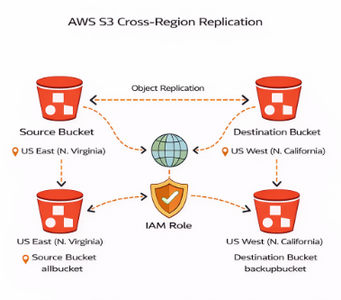
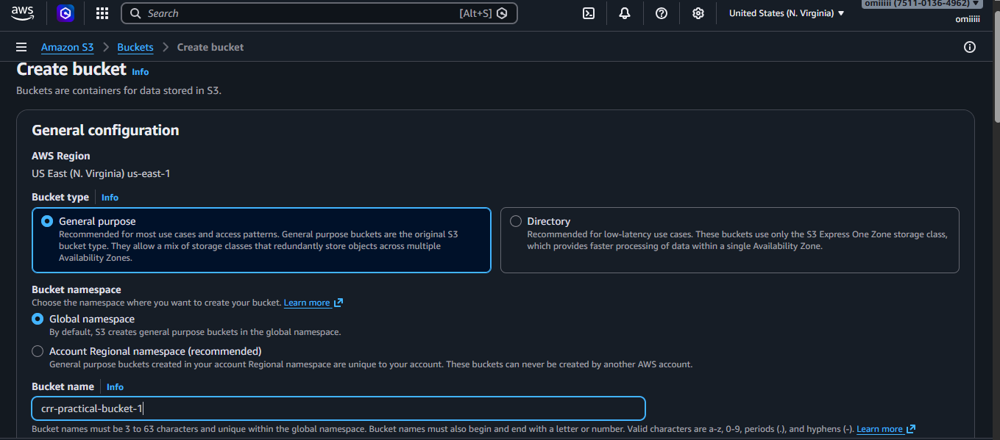
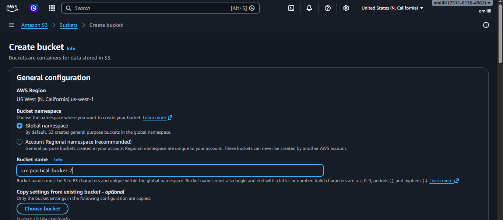
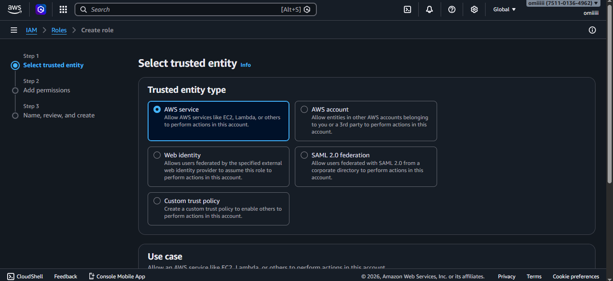

# AWS S3 Cross-Region Replication (CRR)

## Introduction
This project demonstrates the implementation of **Amazon S3 Cross-Region Replication (CRR)**, a feature that automatically replicates objects from a source S3 bucket in one AWS region to a destination bucket in another region.

CRR is widely used for **data redundancy, disaster recovery, compliance requirements, and low-latency access** across geographically distributed locations.

In this project, replication is configured from:
- **US East (N. Virginia)** → **US West (N. California)**


---

## Project Objective
- Implement cross-region data replication
- Ensure high availability and durability of data
- Understand IAM roles and permissions for S3 replication
- Learn versioning requirements for CRR

---

## Technologies Used
- Amazon S3
- AWS IAM
- Cross-Region Replication (CRR)
- AWS Regions (N. Virginia & N. California)

---

## Architecture Overview

Source Bucket (N. Virginia)
        ↓
Replication Rule + IAM Role
        ↓
Destination Bucket (N. California)

---

## Step-by-Step Implementation

### Step 1: Create Source Bucket
- Created S3 bucket in **US East (N. Virginia)** region

---

### Step 2: Create Destination Bucket
- Created S3 bucket in **US West (N. California)** region

---

### Step 3: Enable Versioning
- Enabled versioning on both source and destination buckets

**Note:** Versioning is mandatory for CRR to work.

---

### Step 4: Create IAM Role for Replication
- Created IAM role with required permissions

#### ✅ IAM Policy JSON
```json
{
  "Version": "2012-10-17",
  "Statement": [
    {
      "Effect": "Allow",
      "Action": [
        "s3:GetReplicationConfiguration",
        "s3:ListBucket"
      ],
      "Resource": "arn:aws:s3:::source-bucket-name"
    },
    {
      "Effect": "Allow",
      "Action": [
        "s3:GetObjectVersion",
        "s3:GetObjectVersionAcl"
      ],
      "Resource": "arn:aws:s3:::source-bucket-name/*"
    },
    {
      "Effect": "Allow",
      "Action": [
        "s3:ReplicateObject",
        "s3:ReplicateDelete"
      ],
      "Resource": "arn:aws:s3:::destination-bucket-name/*"
    }
  ]
}
```

---

#### ✅ Trust Relationship JSON
```json
{
  "Version": "2012-10-17",
  "Statement": [
    {
      "Effect": "Allow",
      "Principal": {
        "Service": "s3.amazonaws.com"
      },
      "Action": "sts:AssumeRole"
    }
  ]
}
```

---

### Step 5: Configure Replication Rule
- Opened source bucket settings
- Enabled **Replication Rule**
- Selected destination bucket
- Attached IAM role
- Enabled replication for all objects

---

### Step 6: Test Replication
- Uploaded new objects to source bucket
- Verified that objects were automatically replicated to destination bucket

---

## Important Learning
- Only **new objects** are replicated by default
- Existing objects are **not replicated automatically**

### 🔁 To replicate existing objects:
- Use **S3 Batch Replication**

---

## Key Features
- Automatic cross-region data replication
- High durability and availability
- Secure replication using IAM roles

---

## Advantages of CRR
- Disaster recovery readiness
- Geographic redundancy
- Reduced latency for global users
- Data compliance across regions

---

## Limitations
- Existing objects not replicated by default
- Additional storage cost in destination region
- Slight replication delay

---

## Conclusion
This project successfully demonstrates the implementation of **S3 Cross-Region Replication (CRR)** for automatic data synchronization between AWS regions.

It highlights real-world cloud architecture practices such as **data redundancy, security, and disaster recovery**.

---

**Project Implemented Using AWS S3 CRR ☁️🌍**

